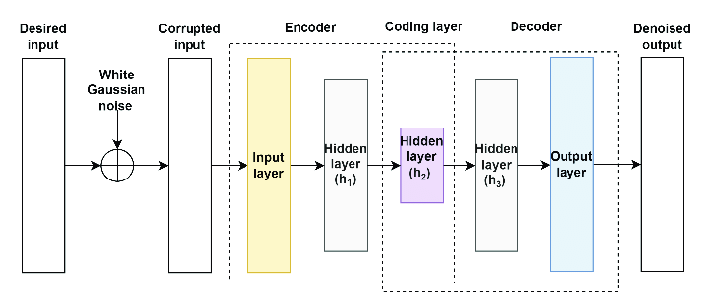
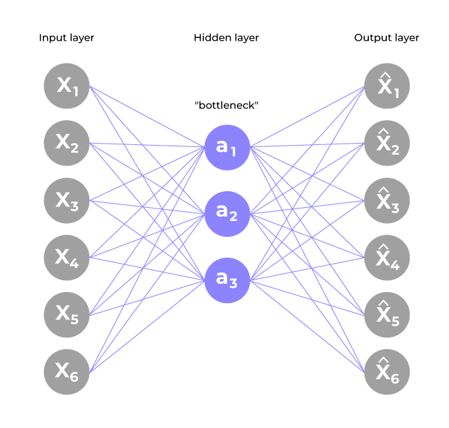
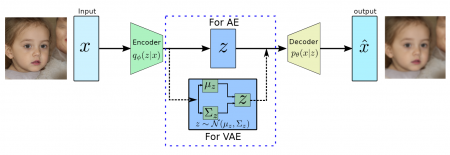

# Exploring-Autoencoders-with-FashionMNIST-Dataset

# Overview

This project explores the implementation and evaluation of various types of autoencoders using the FashionMNIST dataset in PyTorch. Autoencoders are a class of neural networks used for unsupervised learning, primarily for tasks like data denoising, dimensionality reduction, and generative modeling. This repository implements five types of autoencoders: Fully Connected Autoencoder (FC-AE), Convolutional Autoencoder (CNN-AE), Sparse Autoencoder (Sparse-AE), Recurrent Autoencoder (RNN-AE), and Variational Autoencoder (VAE). Each model is trained and evaluated on the FashionMNIST dataset, with visualizations of their reconstructed outputs.

## What is an Autoencoder?

An autoencoder is a neural network designed to learn a compressed representation (encoding) of input data and reconstruct it as accurately as possible. It consists of two main components:

- **Encoder**: Compresses the input data into a lower-dimensional latent space representation.
- **Decoder**: Reconstructs the input data from the latent representation.

The goal is to minimize the reconstruction error between the input and the output, enabling the autoencoder to learn meaningful features of the data. Autoencoders are widely used for tasks such as image denoising, anomaly detection, and generative modeling.

## General Autoencoder Architecture

Below is a diagram illustrating the general architecture of an autoencoder:

- **Input Layer**: Receives the input data (e.g., a flattened FashionMNIST image of size 28x28 = 784 pixels).
- **Encoder**: Reduces the input to a latent representation (bottleneck layer).
- **Latent Space**: A compressed representation of the input.
- **Decoder**: Reconstructs the input from the latent representation.
- **Output Layer**: Produces the reconstructed data, ideally matching the input.

*Figure: General architecture of an Autoencoder*

---

## Types of Autoencoders Implemented

This project implements five distinct types of autoencoders, each with unique characteristics and architectures. Below, we describe each type in detail, including their specific architectures and diagrams.

### 1. Fully Connected Autoencoder (FC-AE)

#### Description

The Fully Connected Autoencoder (FC-AE) uses fully connected (dense) layers in both the encoder and decoder. It flattens the input image into a vector and processes it through linear layers with activation functions (e.g., ReLU, Sigmoid). This model is simple but may struggle with capturing spatial relationships in image data.

#### Architecture

**Encoder**:
- Input: Flattened 28x28 image (784 units)
- Linear(784, 128) → ReLU
- Linear(128, 64) → ReLU

**Decoder**:
- Linear(64, 128) → ReLU
- Linear(128, 784) → Sigmoid
- Output: Reshaped to 1x28x28

#### Diagram

_(Insert FC-AE diagram here)_

*Figure: Architecture of an Fully Connected Autoencoder*

#### Key Features
- Simple architecture with fully connected layers.
- Suitable for non-spatial data but less effective for images due to loss of spatial structure.
- Trained with Mean Squared Error (MSE) loss.

---

### 2. Convolutional Autoencoder (CNN-AE)

#### Description

The Convolutional Autoencoder (CNN-AE) leverages convolutional neural networks (CNNs) to capture spatial hierarchies in image data. It uses convolutional layers for encoding and transposed convolutional layers for decoding, making it more suitable for image data like FashionMNIST.

#### Architecture

**Encoder**:
- Conv2d(1, 16, kernel=3, padding=1) → ReLU → MaxPool2d(2)
- Conv2d(16, 32, kernel=3, padding=1) → ReLU → MaxPool2d(2)

**Decoder**:
- ConvTranspose2d(32, 16, kernel=3, stride=2, padding=1, output_padding=1) → ReLU
- ConvTranspose2d(16, 1, kernel=3, stride=2, padding=1, output_padding=1) → Sigmoid
- Output: 1x28x28 image

#### Diagram

_(Insert CNN-AE diagram here)_

*Figure: Architecture of an Convolutional Autoencoder (CNN-AE)*

#### Key Features
- Uses convolutional layers to preserve spatial relationships.
- Effective for image reconstruction tasks.
- Trained with MSE loss.

---

### 3. Sparse Autoencoder (Sparse-AE)

#### Description

The Sparse Autoencoder (Sparse-AE) is similar to the FC-AE but incorporates a sparsity constraint to encourage the network to learn a sparse representation in the latent space. This is achieved by adding a regularization term (e.g., L1 penalty) to the loss function, promoting fewer active neurons.

#### Architecture

**Encoder**:
- Linear(784, 128) → ReLU
- Linear(128, 64) → ReLU

**Decoder**:
- Linear(64, 128) → ReLU
- Linear(128, 784) → Sigmoid
- Output: Reshaped to 1x28x28

#### Diagram

_(Similar to FC-AE but with sparsity constraint)_

*Figure: Architecture of an Sparse Autoencoder (Sparse-AE)*

#### Key Features
- Encourages sparse latent representations, reducing overfitting.
- Trained with MSE loss plus a sparsity penalty (L1 regularization).

---

### 4. Recurrent Autoencoder (RNN-AE)

#### Description

The Recurrent Autoencoder (RNN-AE) uses Long Short-Term Memory (LSTM) layers to process the input data as a sequence. It treats each row of the 28x28 image as a sequence step, making it suitable for sequential data but less common for static images like FashionMNIST.

#### Architecture

- **Encoder**: LSTM(28, 128, batch_first=True)
- **Decoder**: LSTM(128, 28, batch_first=True)
- **Input/Output**: Reshaped to (batch, 28, 28) and back to 1x28x28

#### Diagram

_(Insert RNN-AE diagram here)_

*Figure: Architecture of an Recurrent Autoencoder (RNN-AE)*

#### Key Features
- Processes data as sequences, capturing temporal dependencies.
- Less effective for static images but included for exploration.
- Trained with MSE loss.

---

### 5. Variational Autoencoder (VAE)

#### Description

The Variational Autoencoder (VAE) is a generative model that learns a probabilistic latent space. Unlike traditional autoencoders, it models the latent variables as distributions (mean and variance) and uses a reparameterization trick to enable backpropagation. It balances reconstruction loss with a KL-divergence term to regularize the latent space.

#### Architecture

**Encoder**:
- Linear(784, 400) → ReLU
- Linear(400, latent_dim=32) (mean)
- Linear(400, latent_dim=32) (log variance)
- Reparameterization: Sample latent vector using mean and log variance

**Decoder**:
- Linear(32, 400) → ReLU
- Linear(400, 784) → Sigmoid
- Output: Reshaped to 1x28x28

#### Diagram

_(Insert VAE diagram here)_

*Figure: Architecture of an Variational Autoencoder (VAE)*

#### Key Features
- Generative model capable of sampling new data.
- Uses MSE loss plus KL-divergence for regularization.
- Suitable for generating new images similar to the training data.

---

## Comparison of Autoencoders

| Autoencoder Type | Architecture         | Latent Space             | Loss Function            | Strengths                           | Weaknesses                             |
|------------------|----------------------|---------------------------|---------------------------|--------------------------------------|----------------------------------------|
| FC-AE            | Fully connected layers | Fixed-size vector        | MSE                      | Simple, fast training                | Loses spatial information              |
| CNN-AE           | Convolutional layers   | Feature maps             | MSE                      | Captures spatial hierarchies         | More parameters than FC-AE             |
| Sparse-AE        | Fully connected layers | Sparse vector            | MSE + L1 regularization  | Reduces overfitting                  | Requires tuning sparsity parameter     |
| RNN-AE           | LSTM layers            | Sequential latent states | MSE                      | Suitable for sequential data         | Inefficient for static images          |
| VAE              | Fully connected layers | Probabilistic (mean, var)| MSE + KL-divergence      | Generative capabilities              | Complex training, higher loss          |

---

## Results
The project trains each autoencoder for 50 epochs on the FashionMNIST dataset and evaluates their performance using MSE loss. The final losses are printed, and a visualization compares the original and reconstructed images for a sample test image. The CNN-AE typically achieves the lowest reconstruction loss due to its ability to capture spatial features, while the VAE has a higher loss due to the additional KL-divergence term.

*Figure: Comparison of Original and Reconstructed FashionMNIST Images by Different Autoencoders After 50 Epochs of Training*
